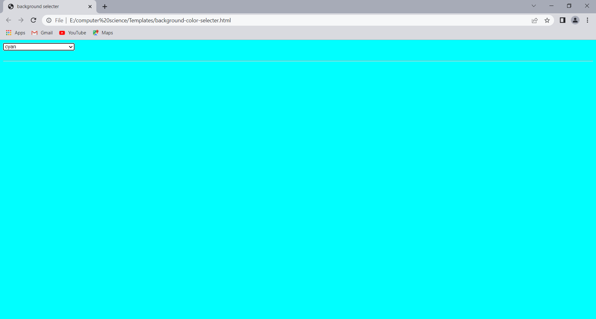
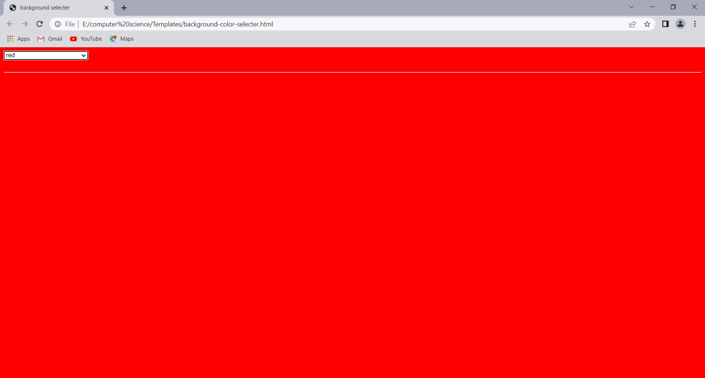
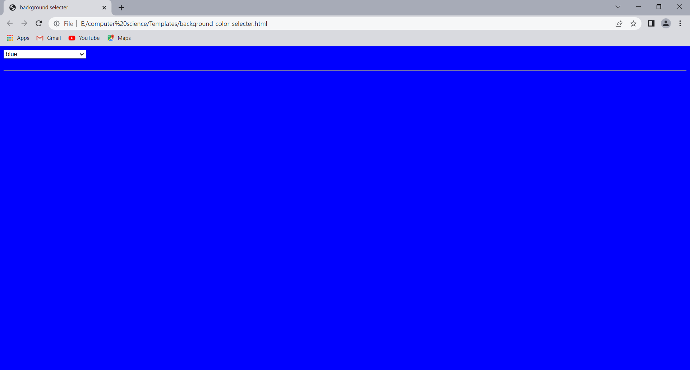

# Background-color-selector

**This is a background color selector using html and javascript**

**The screenshots of the above program is given below**

**This is showing option to change color**

